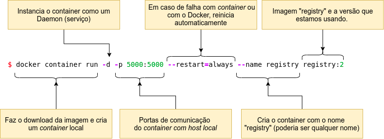

# <center> Implementar um Registry local</center>


### Resumo


Esta página foi elaborada com informações básicas sobre como você pode manter seus **Containers** usando o Docker Distribution em seu ambiente local.


O [Docker Distribuition](https://github.com/distribution/distribution) é um *registry* repositório de imagens Docker local que serve para guardar e compartilhar as suas imagens. 


### Aviso


Esta é uma sugestão de uma configuração inicial para o Registry local e em máquinas de testes ou desenvolvimento. Não implemente um servidor de registro em produção sem proteção por TLS e um mecanismo de controle de acesso.


### Pré-requisitos:    

    - Máquina com sistema operacional Linux.
    - Você precisa ter o Docker instalado em sua máquina local.


### Criar o Registry Local


Para que possamos ter o Docker Distribuition de forma simples e funcional, guardando e distribuindo nossas imagens Docker localmente, basta rodá-lo como um *container*, execute o seguinte comando:




<!-- #region -->
```python
$ docker container run -d -p 5000:5000 --restart=always --name registry registry:2
```
<!-- #endregion -->

**Resultado da execução**


O container ID **50086bf481e753e39f8098487594cf85827d040af41f5c989fccffbc8dc0d782** foi criado com sucesso!


Você pode verificar se o container "registry" está em execução, através de um dos comandos abaixo:

<!-- #region -->
```python
$ docker container ls

```
<!-- #endregion -->


<!-- #region -->
```python
$ docker container ps 

```
<!-- #endregion -->


<!-- #region -->
```python
$ docker ps

```
<!-- #endregion -->


O *container* foi criado e está em execução. Agora vamos testá-lo realizando a submissão de uma imagem de teste no repositório.


Quando você criar um *container* registry, uma estrutura de diretórios será construída em sua máquina local onde  todas as imagens enviadas serão organizadas. Para descobrir a localização do repositório, observe o comando abaixo:


**Lembrando que:**  O repositório será montado no sitema de arquivos Linux somente se o *container* registry estiver em execução (rodando)

<!-- #region -->
```python
$ df -h
```
<!-- #endregion -->


### Testar o Registry Local


1) Baixe uma imagem [Docker Hub](https://hub.docker.com/_/centos) usando o comando abaixo:

<!-- #region -->
```python
$ docker pull centos

```
<!-- #endregion -->


2) Para verificar as imagens baixas digite:

<!-- #region -->
``` python
$ docker image ls

```
<!-- #endregion -->


3) Vamos preparar a imagem **centos** ID 300e315adb2f para envio ao repositório "registry" local. Teremos que adicionar uma nova TAG apontando para o endereço do registry. Para isso, vamos utilizar o comando "docker tag".

<!-- #region -->
```python
$ docker tag 300e315adb2f localhost:5000/centos
    
``` 
<!-- #endregion -->


4) A imagem ```localhost:5000/centos``` está pronta para enviarmos para o repositório. Antes e por curiosidade, vamos ver a estrutura de arquivos do repositório e o espaço inical em disco ocupado. 


Na versão [Docker Entreprise](https://docs.docker.com/engine/reference/commandline/registry_ls/), exitem outros comandos que ajudam na gestão do repositório, tais como: 

<!-- #region -->
```python
$ docker registry events	
$ docker registry history	
$ docker registry info	
$ docker registry inspect	
$ docker registry joblogs	
$ docker registry jobs	
$ docker registry ls	
$ docker registry rmi

```
<!-- #endregion -->

5 ) Enviar a imagem para o repositório

<!-- #region -->
```python
$ docker push localhost:5000/centos

```
<!-- #endregion -->


**Feito! a imagem foi arquivada no repositório local.***


Vamos testar a recuperação ou distribuição da imagem via repositório criado. Para isto, vamos apagar do cache a imagem do CentOS que baixamos e a imagem que foi preparada.

<!-- #region -->
```python
$ docker image ls

```
<!-- #endregion -->


<!-- #region -->
```python
$ docker image rm -f 300e315adb2f (Este comando apaga imagem 300e315adb2f)
```
<!-- #endregion -->


<!-- #region -->
```python
$ docker image ls

```
<!-- #endregion -->


Agora que apagamos as imagens do cache, para finalizamos o teste, vamos baixar a imagem do CentOS que está no repositório local.

<!-- #region -->
```python 
$ docker pull localhost:5000/centos
```
<!-- #endregion -->


<!-- #region -->
```python 
$ docker image ls
```
<!-- #endregion -->


***Pronto! a imagem foi baixada do repositório local.***

Eu uso o Docker Distribuition em ambiente de desenvolvimento e acadêmico fora da Internet para centralizar, organizar e compartilhar as imagens dos projetos os quais estamos trabalhando com o restante das equipes. E, as imagens mais importantes sempre faço um backup externo. (O que eu recomendo)

Caso, você esteja pensando em implementar um servidor Registry em produção, eu sugiro uma leitura complementar em [Docker Registry](https://docs.docker.com/registry/deploying/) para a implementação de regras adicionais de segurança. 


Sou muito grato pela sua atenção. Espero ter contribuido com o seu desenvolvimento de alguma forma.


<!-- #region -->


[Carlos Eugênio](https://carlosemsantana.github.io/)


<!-- #endregion -->

 


**Referências:**

1. [Docker](https://www.docker.com/get-started) 
2. [Docker Registry](https://docs.docker.com/registry/deploying/)
3. Livro: Descomplicando o Docker 2a edição<br>
   Jeferson Fernando Noronha Vitalino<br>
   Marcus André Nunes Castro


```python

```
